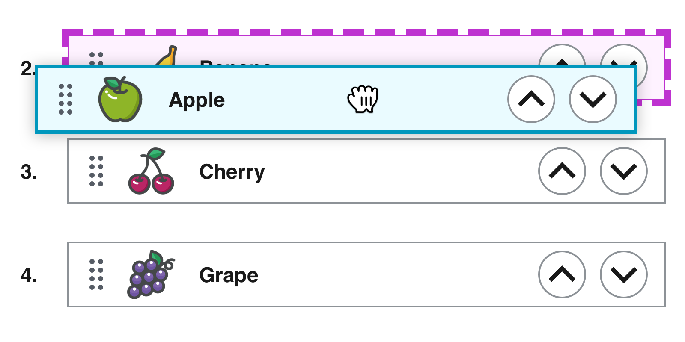

## 문제



이미지와같이 사용자가 데이터들을 이리저리 재정렬하는 경우 이 연산의 영속성을 다룰 때 해당 데이터의 스키마를 설계할 때 주의해야한다. 재정렬 기능을 구현하려면 컬럼에 정렬 키가 들어가야하는데 이럴 경우 발생하는 문제는:

1. 정렬키를 정수로 사용할 경우

   ```
   name     | orderKey
   -----------------
   Banana   |    2 
   <target> |     <== 공간 없음, 뒤에 있는 orderKey값들을 모두 1씩 밀어줘야함
   Cherry   |    3
   Grape    |    4
   ```

   이 경우 n과 n+1 사이에 정수가 없다. 따라서 n+1이상의 정수 키 값을 가진 데이터들은 모두 업데이트가 되므로 최악의 경우 O(n)의 업데이트가 발생한다.

2. 리스트로 저장할 경우

   이 경우 쓸데없이 비정규화를 하게되므로 좋지않다. 그리고 데이터가 많아질수록 성능적인 문제가 발생할 것이다.


## 해결전략

문제의 핵심 원인은 재정렬되는 아이템만 업데이트하면 되는데 그 외의 데이터들까지 업데이트에 연관시키는 데에 있습니다. 따라서 해당 아이템만 업데이트하는 방식을 고안해야합니다.

#### 외부 사례

- [Jira의 사례](https://www.reddit.com/r/jira/comments/48tnfy/how_does_ranking_an_issue_in_jira_software_work/)
- [Figma의 사례](https://www.figma.com/blog/realtime-editing-of-ordered-sequences/)

Jira, Figma 두 회사는 앞에서 언급한 문제들을 해결하기 위해 정렬키를 문자열의 사전식 정렬을 사용해 해결하였습니다. Jira는 알파벳, Figma는 임의정밀도 소수를 사용한 것에 차이가 있습니다. 

해당 방식들을 짧게 도식화하면:

- 알파벳기반

  ```
  title  | order
  ---------------
  apple  | 'a'
  banana | 'b'
         |   <== 'bn', 정렬 키값을 'bn'으로 바꾸기만 하면 재정렬 업데이트가 끝납니다.
  note   | 'c'
  book   | 'd'
  ```

- 소수기반, 앞에 `0.` 은 제외

  ```
  title  | order
  ---------------
  apple  | '0'
  banana | '25'
         |   <== '2875', 정렬 키값을 '2875'로 바꾸기만하면 재정렬 업데이트가 끝납니다.
  note   | '325'
  book   | '5'
  ```

두 방법은 두 데이터 사이의 정렬키 값을 구할 때 중앙값을 사용하는데  임의정밀도 소수를 사용한 방법은 문자열의 길이가 나눌때마다 늘어나므로 저장공간을 더 많이 사용합니다. 이런 점 떄문에서 확장성이 더 좋은 알파벳기반  방식을 사용합니다.


## 성공기준

- [x] 두 개의 키 `prev`, `next`가 주어질 경우 산술적으로 `prev`와 `next`의 중앙값을 구할 수 있어야 한다.

  - [x] 데이터를 맨 앞으로 재정렬하고 싶을 경우 기존의 맨 앞 정렬키를 `next`로 사용한다.
  - [x] 데이터를 맨 끝으로 재정렬하고 싶을 경우 기존의 맨 끝 정렬키를 `prev`로 사용한다.

- [x] 테이블에 아무런 데이터가 없을 경우 중앙값을 구하기 위한 키가 존재하지않으므로 초기 키값을 구할 수 있어야한다. 해당 기능은 효율적인 정렬시스템으로 마이그레이션할 때도 유용하다.

- [x] DB가 가능한 한 적은 저장공간을 사용하도록 알고리즘의 전략을 구성한다.

  

## 프로젝트

2022년 1월 21일 완료, [pub.dev 출시](https://pub.dev/packages/lexicographical_order)
