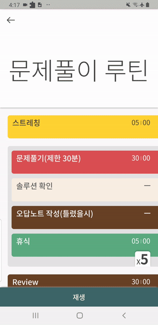

목표를 이루려면 시간이라는 자원을 투자해야만 합니다. 

하지만 항상 게으름과 싸우고 비효율과 싸우고 방해꾼들과 싸우며 투자대비 수익률이 시원찮은 상황이 계속 이어집니다. 그렇다고 손실을 줄이기 위해 투자금을 줄일 수도 없습니다. 시간은 누구나 공평하게 흐르니까요. 

따라서 명백한건 목표를 이루기 위해서는 시간관리는 필수라는 것입니다.

사실 저희가 신도아니고 "시간"자체를 관리할 수는 없습니다. *주어진 시간에 무엇을* 하느냐가 시간관리의 핵심입니다.

여기서 보통 목표를 이루기 위해 무엇을 할것인지는 곧잘 계획하고 실행합니다. 그리고 나중에 생각보다 낮은 성과에 실망합니다. 왜 그럴까요?

시간관리가 안되었기 때문입니다. 무엇을 할 것인지만 계획했지 그것을 할 때 주어진 시간을 어떻게 활용해야할지는 전혀 계획되지않았거나 체계없이 관리했기 때문입니다.

## 효율적인 시간활용

주어진 시간을 어떻게 활용해야할지는 정말 광범위한 주제입니다. 

주제를 운동으로 국한시키더라도 운동의 종류는 셀 수 없이 많을 뿐더러 각 운동마다 운동자세, 수행시간과 휴식시간을 어떻게 관리할 것지에 대한 방법론 등을 수많은 기관에서 연구하고 발전시켜왔습니다. 운동을 제외한 다른 분야또한 마찬가지입니다. 

따라서 이 글에서 해당 방법론들에 대해서는 자세히 다루지는 않겠습니다. 구글링이나 책을 이용하면 대부분 원하는 솔루션을 얻을 수 있습니다. 신제품개발같은 대형 프로젝트의 경우는 이미 비슷한 경험을 해본 다른 사람들의 경험들을 구매할 수도 있습니다.

## 방해요소

목표를 이루기위해 주어진 시간 내에 무엇을 어떻게 할지 잘 찾아보고 계획했습니다. 하지만 여전히 문제는 남아있습니다. 정말 내 계획이 잘 작동하고 있는걸까요? 

대부분의 경우 성과가 시원찮은 건 목표를 이루기위해 설계해놓은 시스템이 잘 작동하지 않았기 때문입니다. 

만약 계획 자체에 문제가 있지않는데 잘 작동하지않은 이유는 그 계획을 달성하기 위한 방해요소들을 제거하지 못 했기 때문입니다. 

게으름, 놀고싶은 욕구, 추가적인 업무할당, 이메일 확인, "오늘 열심히 했다"(실제로 열심히 했을까?) 등 정말 세상은 방해요소들로 넘쳐납니다. 마치 열역학 제 2법칙처럼 사람은 무질서도가 높아지는 방향으로 어떻게든 움직이려하는 것처럼 보입니다. 

따라서 계획을 계획대로 수행하기 위해서는 이런 방해요소들을 제거하려는 노력을 통해 질서있는 일과수행이 필요합니다.

## 자기합리화

