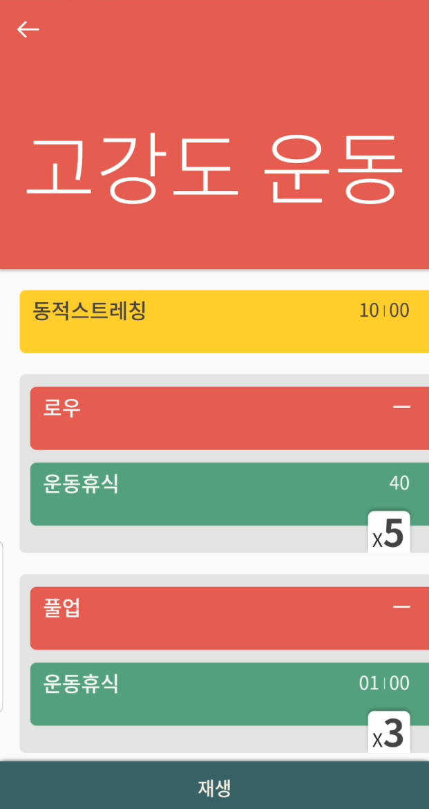
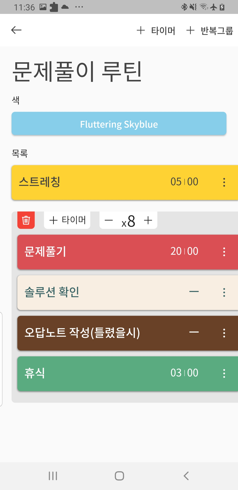
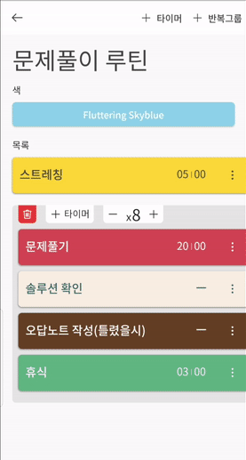
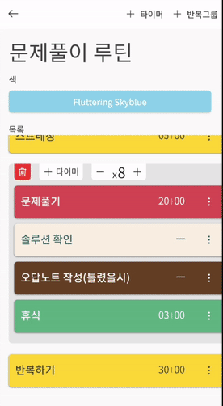
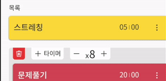
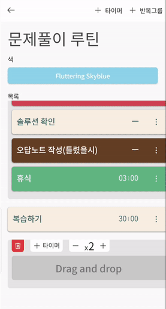
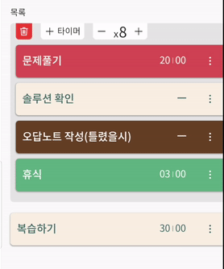
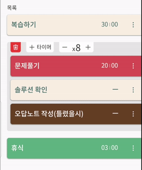
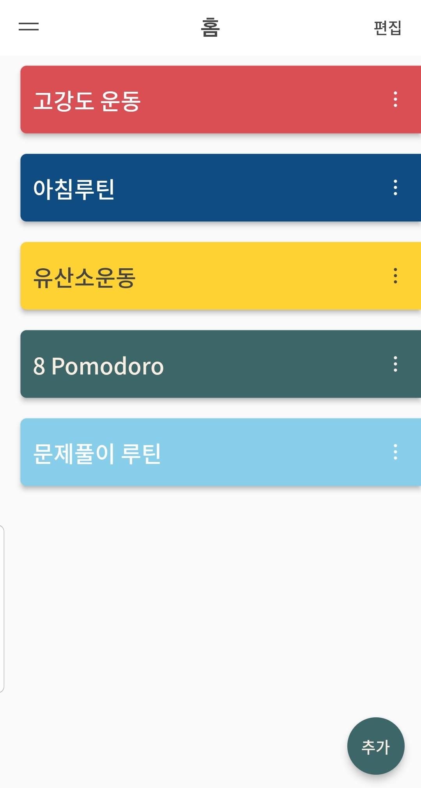

목표를 이루려면 시간이라는 자원을 투자해야만 합니다. 하지만 항상 게으름과 싸우고 비효율과 싸우고 방해꾼들과 싸우며 수익률이 시원찮은 상황이 계속 이어집니다. 그렇다고 손실을 줄이기 위해 투자금을 줄일 수도 없습니다. 시간은 누구나 공평하게 흐르니까요. 따라서 목표를 이루기 위해서는 시간관리가 필수입니다.

사실 저희가 “시간” 자체를 관리할 수는 없습니다. 주어진 시간에 무엇을 하느냐가 시간 관리의 핵심입니다.

여기서 보통 목표를 이루기 위해 무엇을 할 것인지는 곧잘 계획하고 실행합니다. 그리고 나중에 생각보다 낮은 성과에 실망합니다. 왜 그럴까요? 

시간 관리가 안 되었기 때문입니다. 무엇을 할 것인지만 계획했지, 그것을 할 때 주어진 시간을 어떻게 활용해야 할지는 전혀 계획되지 않았거나 체계 없이 관리했기 때문입니다.

## 효율적인 시간활용

주어진 시간을 어떻게 활용해야 할지는 정말 광범위한 주제입니다.

주제를 운동으로 국한하더라도 운동의 종류는 셀 수 없이 많을뿐더러 운동마다 운동 자세, 수행시간과 휴식 시간을 어떻게 관리할 것인지에 대한 방법론 등을 수많은 기관에서 연구하고 발전시켜왔습니다. 운동을 제외한 다른 분야 또한 마찬가지입니다.

따라서 이 글에서 해당 방법론들에 대해서는 자세히 다루지는 않겠습니다. 구글링이나 책을 이용하면 대부분 원하는 솔루션을 얻을 수 있습니다. 신제품개발 같은 대형 프로젝트의 경우는 이미 비슷한 경험을 해본 다른 사람들의 경험을 구매할 수도 있습니다.

## 방해요소

목표를 이루기 위해 주어진 시간 내에 무엇을 어떻게 할지 잘 찾아보고 계획했습니다. 하지만 여전히 문제는 남아있습니다. 정말 내 계획이 잘 작동하고 있는 걸까요?

대부분의 경우 성과가 시원찮은 건 목표를 이루기 위해 설계해놓은 시스템이 잘 작동하지 않았기 때문입니다.

계획 자체에 문제가 있지 않은데 잘 작동하지 않은 이유는 그 계획을 달성하기 위한 방해 요소들을 제거하지 못했기 때문입니다.

게으름, 놀고 싶은 욕구, 추가적인 업무 할당, 이메일 확인, "오늘 열심히 했다."(실제로 열심히 했을까?) 등 정말 세상은 방해 요소들로 넘쳐납니다. 마치 열역학 제2 법칙처럼 사람은 무질서 도가 높아지는 방향으로 어떻게든 움직이려 하는 것처럼 보입니다.

이런 다양한 방해요소들은 낮은 시간투자효율을 유발하며 목표를 달성할 확률을 떨어트립니다. 만약 달성했더라도 방해요소를 극복했다면 결과물의 퀄리티가 분명 더 좋았을 것입니다.

따라서 계획을 계획대로 수행하기 위해서는 이런 방해 요소들을 제거하려는 노력을 통해 질서 있는 일과 수행이 필요합니다.

## 자기 합리화

이를 해결하는것은 단순합니다. 행동들을 측정하고 기록해 해당 데이터로 판단하는 것입니다. 다양한 방해 요소들이 있지만 가장 경계해야 할 적은 혼자 판단하는 것입니다. 사람은 기본적으로 자신한테 불리하거나 불편한 부분을 무의식적으로 감춥니다. 이런 행동 특성 때문에 그렇게 잘하지도 열심히 하지도 않았지만, 열심히 잘했다고 생각하거나 "내일 해야지"처럼 미루게는 등 **자기합리화** 상태에 빠지게 됩니다.

자기합리화는 목표 달성 실패에서 상당히 많은 지분을 차지하며 혼자 추진하는 목표든 여럿이서 추진하는 목표든 정말 위험한 현상입니다.

이를 해결하는 것은 단순합니다. 행동들을 측정하고 기록해 해당 데이터로 판단하는 것입니다. 혼자 판단하지 않으면됩니다.

## 데이터로 판단하기

활동을 측정하고 기록하려면 타이머와 노트만 있으면 됩니다. 시간을 측정하고 손으로 기록하는 것이죠.

그런데 직접 일일이 측정하고 기록하는 것은 일단 귀찮은 것도 있지만 다음과 같은 단점이 있습니다. 

실수로 집중하다가 측정하는 것을 잊어먹는 상황이 빈번하게 일어납니다. 또 측정의 일관성이 떨어져 기록된 데이터의 정확도가 떨어집니다.

물론 해당 활동을 얼마나 잘 수행했는지 완벽한 정확도로 측정하고 기록하는 것은 불가능합니다. 또한 그렇게 해서도 안 됩니다.

왜냐하면 측정과 기록 또한 별도의 시간을 투자하는 것이며 이는 간접비용이기 때문에 최소한의 간접비용을 지불하는 것이 좋습니다. 즉, 최소한의 노력으로 최대한의 정확도로 측정하고 기록해야합니다.

이를 위해서는 자동화된 프로그램을 활용하는 것이 제격입니다.

## 실프리 타이머 앱

이러한 시간을 측정해주는 애플리케이션들은 정말 많이 있습니다. 하지만 타이머가 한 앱의 부가 기능으로 들어가 있거나 타이머 기능만 있는 앱의 경우 충분히 고민이 되지 않은 모습에 운동이나 공부같은 특정 분야에서만 사용할 수 있다든가 그마저도 어딘가 한두 개씩 부족한 모습을 보여줍니다.

아마 타이머로 비즈니스를 하기에는 규모가 아주 작기 때문이겠죠. 결국 돈이 있어야 제품을 개발하고 해당 제품의 품질이 올라가니까요.

그런데 각 앱들이 나사가 하나씩 빠졌던 문제들을 해결한 타이머 앱이 있습니다. 

바로 실프리 타이머 (Sylfree Timer)입니다.

# 실프리 타이머

실프리 타이머는 다양한 목표들을 측정하고 기록하는 완벽에 가까운 도구로서 활용할 수 있습니다. 아래는 시험공부 연습문제를 풀 때 제가 사용했던 타이머의 실제 예시입니다. 

가볍게 스트레칭을 하고 문제 5개를 풀기로합니다. 문제를 풀 때는 문제풀이 => 솔루션체크 =>  틀렸을 시 오답노트 작성 => 휴식 순서로 진행되고 해당 과정은 `x5` 에 나와있는 것처럼 총 5회 반복됩니다. 그리고 마지막으로 30분동안 복습하는 시간을 갖습니다.

실프리 타이머가 좋은 이유는 업무, 운동, 공부, 요리, 습관형성 등 정말 다양한 상황에 무리없이 적용이 가능합니다. 좀 더 많은 예시를 보여드리자면:

- **Pomodoro 기법**
  
  
  
  유명한 뽀모도로 기법입니다. 저도 애용하는 기법입니다.

- **운동루틴**
  
  
  
  근력운동은 수행시간과 휴식시간을 엄격하게 지키는 것이 효울적인 근성장의 상당 부분을 차지하기 때문에 운동할 때는 무조건 실프리 타이머를 켜놓고 합니다.

이렇게 원하는 활동에 맞는 타이머를 커스텀해서 추가할 수 있는데요. 이는 타협하지않은 실프리 타이머만의 강력한 편집기능 때문입니다.

# 강력한 편집기능

실프리 타이머는 기존 제약이 많은 기성 엔진과 라이브러리를 이용하지 않고 자체 개발된 시스템으로 돌아가기 때문에 다양한 활동들의 시간을 관리할 수 있습니다.

### 전체 편집화면

타이머를 편집하는 화면입니다. 

### 타이머

- **추가**
  
  새로운 타이머를 추가합니다. 타이머의 타이틀, 색상, 시간을 설정하실 수 있습니다. 시간이 설정하지 않으면 스탑워치로 동작합니다.
  
  

- **수정**
  
  오른쪽 **︙** 버튼을 누르고 "편집"을 클릭하시면 팝업이 뜨는데 타이머 추가 때와 동일한 방식으로 설정해주시면 됩니다.
  
  

- **삭제**
  
  오른쪽 **︙** 버튼을 누르고 "편집"을 클릭하시면 타이머를 삭제할 수 있습니다. 
  
  

### 반복 그룹

- 추가
  
  새로운 반복그룹을 추가합니다. 
  
  

- 반복횟수 수정
  
  -, + 버튼으로 반복횟수를 수정할 수 있습니다. 최대 반복 횟수는 99회입니다.
  
  

- 반복그룹 내 타이머추가
  
  반복그룹 내 타이머를 추가할 수 있습니다. 기존 타이머 추가 때와 동일하게 설정하면 됩니다.
  
  

- 삭제
  
  왼쪽 상단에 휴지통 버튼을 클릭하면 반복그룹이 삭제됩니다.
  
  

#### 순서 바꾸기

- **기본**
  
  타이머를 길게 클릭하면 드래그가 활성화되며 옮기고 싶은 곳으로 옮길 수 있습니다.
  
  

- **타이머를 반복그룹 안팎으로 옮기기**
  
  단순히 타이머를 반복그룹 안팎으로 드래그하면 됩니다.
  
  
  
  

- **반복그룹 자체를 옮기기**
  
  반복그룹의 오른쪽 상단 부분을 길게 클릭하면 드래그가 활성화되며 같은 방식으로 옮길 수 있습니다. 
  
  

#### 인터벌 타이머

타이머와 반복그룹의 모임을 인터벌 타이머라고 합니다. 홈 화면에서 보실 수 있습니다. 

인터벌 타이머를 클릭하면 해당 인터벌 타이머를 재생시킬 수 있으며 오른쪽 **︙** 버튼을 누르고 "편집"과 "삭제"를 하실 수 있습니다. 

# 하지만

현재 실프리타이머는 정식 출시가 되지 않았고 알파 테스트 단계에 있습니다. 곧 Early Access 출시 예정이니 쫌만 기다려 주세요!
